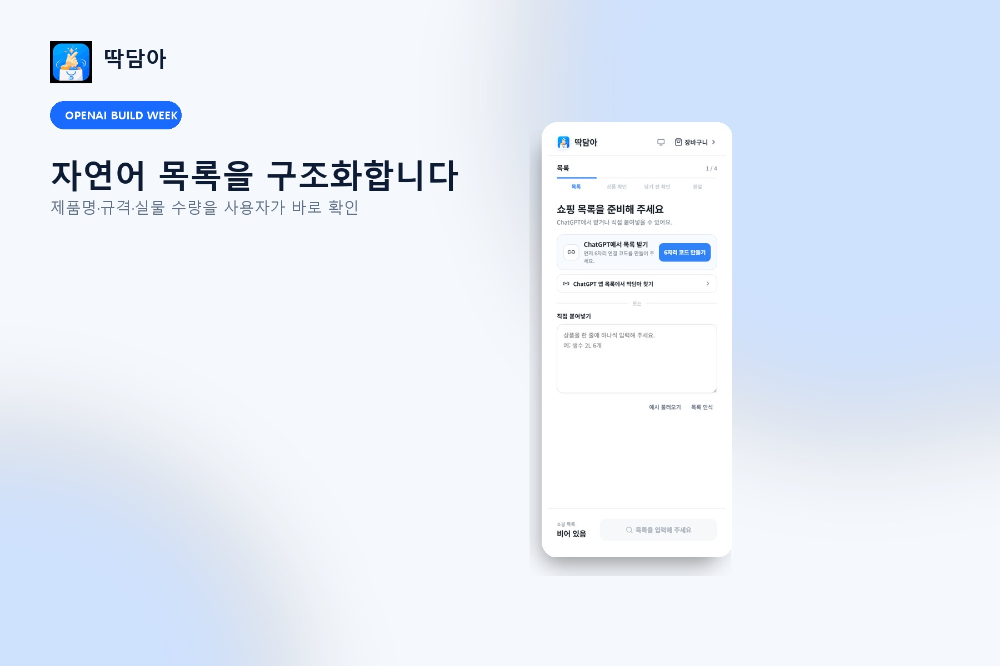
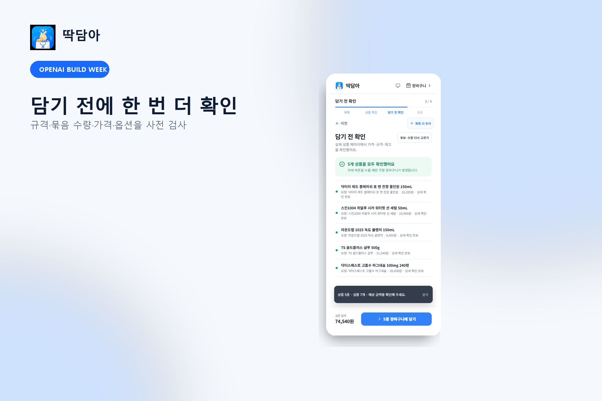
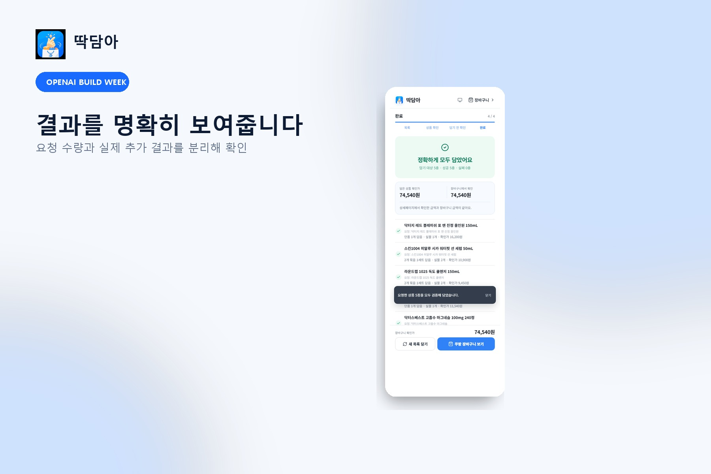

# 딱담아 (DdakDama)

**AI가 짜준 쇼핑 목록을, 사용자가 검토하고 승인한 쿠팡 장바구니로 바꿔주는 서비스.**
*Turn an AI shopping list into a reviewable Coupang cart — ChatGPT app + Chrome extension.*

결제·주문 확정은 절대 자동화하지 않는다. 마지막 확인은 항상 사용자가 쿠팡에서 직접 한다.

- 서비스: <https://ddakdama.ddakdama.workers.dev> · 무설치 체험: [/try](https://ddakdama.ddakdama.workers.dev/try)
- 데모 영상: <https://youtu.be/hpRkAGgw03c> (51초)
- 상태: 공개 베타 v1.0.2 · OpenAI Build Week Devpost 제출 완료

> 이 README는 AI 서비스 기획 발표 흐름(문제 정의 → 타깃 → 시장 → 경쟁 → 제안 → BM → 지표 → 로드맵 → 구현 → 회고)을 따른다. 프레임워크별 상세 근거는 [docs/BOOTCAMP_SERVICE_SPEC_KO.md](docs/BOOTCAMP_SERVICE_SPEC_KO.md)에 있다.

## 발표 흐름

| | | | |
|---|---|---|---|
| 01 문제 정의 | 02 타깃 사용자 | 03 시장 조사 | 04 경쟁 비교 |
| 05 서비스 제안 | 06 비즈니스 모델 | 07 초기 목표 지표 | 08 로드맵 |
| 09 구현 결과 | 10 회고 | 안전 경계 | 문서 |

---

## 01 문제 정의

> **AI가 추천해준 쇼핑 목록을 실제로 사려는 사람**이
> **쿠팡에서 각 품목을 다시 검색할 때**
> **규격·함량·포장 단위를 항목마다 다시 해석하고 비교해야 하는 재작업**을 겪고 있고,
> 그 결과 **잘못된 규격·수량을 담거나, 귀찮아서 구매를 포기하는 일**이 반복된다.

### 문제의 근거

| 관찰 | 검색·재현 | 핵심 인사이트 |
|---|---|---|
| AI 답변과 쿠팡 상품 목록 사이에 연결고리가 없어 품목마다 재검색이 필요하다 | `100mg 240정`처럼 함량·포장·실물 수량이 한 문장에 섞인다 — 고정 목록 회귀 테스트에서 분리 필요성을 확인했다 | 잘못 해석하면 240정 1통을 240개로 담는 등 실제 금전 손실로 이어진다 |

5Why를 따라 내려가면 도달하는 근본 원인은 하나다: **확률적 언어 해석과 결정적 상업 행위 사이에 검증 경계가 없다.** 딱담아가 만드는 것이 바로 이 경계다.

### 사용자 Job (JTBD)

> "AI가 장보기 목록을 만들어준 상황"에서, AI 쇼핑 추천을 실제 구매로 옮기려는 쿠팡 사용자는 **재검색·재비교 없이 정확한 장바구니를 얻는 결과**를 위해 딱담아를 고용한다.

Job은 '자동화'가 아니라 '검증된 전환'이다. 사용자는 손가락 노동을 없애려고 고용하지, 판단을 위임하려고 고용하지 않는다.

## 02 타깃 사용자

### 페르소나 A — "AI로 루틴을 짜는 30대 직장인"

| | |
|---|---|
| 01 기본 정보 | 김민수(가명) · 34세 · IT 직군 · 1인 가구 · 쿠팡 로켓배송 주 1~2회 |
| 02 일과 | ChatGPT에 "여름철 스킨케어 루틴 짜줘" → 5~8종 목록 획득 → 퇴근 후 쿠팡에서 품목마다 재검색 |
| 03 고민 | 가격보다 "맞는 제품인지" 확인에 드는 시간 — mL·정·묶음 단위를 눈으로 대조 |
| 04 현재 해결 | 목록을 보며 쿠팡에 하나씩 검색(30분 이상, 추정) 또는 귀찮아서 포기 |
| 05 지불 의향 | 직접 과금 의사는 낮음(추정) — 수수료가 가격에 포함되는 구조가 적합 |
| 06 목표 | 추천받은 제품을 정확한 규격으로 빠르게 구매 |
| 07 디바이스·앱 | 데스크톱 Chrome · ChatGPT 일상 사용 · 확장 설치 가능 |
| 08 한 줄 인용 | "AI가 다 알려줬는데 왜 사는 건 내가 다시 해야 해?" |

### 페르소나 B — "정기 재구매하는 40대 가구 구매담당"

| | |
|---|---|
| 01 기본 정보 | 이지영(가명) · 41세 · 2인 이상 가구 · 생필품·영양제 정기 구매 |
| 02 일과 | 메모장·카톡에 쌓인 재구매 목록을 월 1회 주문 |
| 03 고민 | "2개"가 단품 2개인지 2개입 1개인지 매번 헷갈려 과잉·부족 구매 |
| 04 현재 해결 | 이전 주문 내역에서 다시 담기 — 신규 품목에는 쓸 수 없다 |
| 05 지불 의향 | 절약형 — 묶음 단위 최적화로 아끼는 비용에 민감(추정) |
| 06 목표 | 동일 상품 재구매 시 묶음 단위 최적 선택 |
| 07 디바이스·앱 | 모바일 쿠팡 앱 중심 · AI 사용 경험 적음 · 목록 붙여넣기는 가능 |
| 08 한 줄 인용 | "같은 걸 또 사는데 왜 매번 똑같이 찾아야 하지?" |

### 유저 저니맵

| 단계 | 사용자 행동 | 감정·불편 |
|---|---|---|
| 01 문제 발생 | AI가 짜준 쇼핑 목록을 실제로 사려고 한다 | 기대 |
| 02 기존 해결 시도 | 품목마다 쿠팡에 다시 검색하고 규격을 대조한다 | 피로·혼란 |
| 03 가장 큰 불편 | 함량·포장·실물 수량이 섞여 잘못 담을 위험이 있다 | 불안 |
| 04 대안 탐색 | 자동화 스크립트·쇼핑 봇을 찾지만 오담기·계정 위험이 걸린다 | 불안 |
| 05 현재 결과 | 결국 수동으로 하나씩 담거나 구매를 포기한다 | 시간 낭비 |

**핵심 문제 구간 = "검색·비교".** 자연어 목록을 상품 SKU로 변환하는 이 구간에 검증 경계를 두면 행동이 바뀐다. 딱담아의 파서·수량 계획·후보 분류·사전검사가 이 구간에 집중되어 있다.

## 03 시장 조사

정량 시장 조사는 아직 수행 전이며, 아래는 정성 분석이다(추정치는 '추정'으로 표기).

- **거시시장**: AI 어시스턴트가 쇼핑 추천까지 수행하는 흐름이 확대되며, "추천 → 구매 전환" 구간이 새로운 인터페이스로 부상하고 있다.
- **미시시장**: 쿠팡 + AI 목록 사용자. "AI 추천 → 수동 재검색"이라는 임시방편이 이미 존재한다는 것 자체가 검증된 pain 신호다.
- **3C**: Customer — AI로 목록을 얻고 쿠팡에서 사는 20~40대 / Company — 확률 해석과 결정 검증을 분리한 아키텍처, 묶음·함량·포장을 독립 모델링한 수량 계획 로직 / Competitor — 수동 검색(느림), 자동화 봇(안전 경계 없음)
- **STP**: AI 쇼핑 사용자를 구매 단계로 세분화 → "목록을 실제 구매로 옮기려는 쿠팡 사용자"를 공략 → "자동화가 아니라 검증된 전환"으로 포지셔닝

## 04 경쟁 비교

| 비교 기준 | 대안 A: 쿠팡 직접 검색·다시담기 | 대안 B: 자동화 스크립트·쇼핑 봇 | 딱담아 |
|---|---|---|---|
| 핵심 문제 해결 | 품목마다 재검색·규격 대조 | 빠르지만 검증 없이 담아 오담기 위험 | 후보 수집 + EXACT/REVIEW 분류 + 승인 게이트 |
| 개인화·AI 활용 | 없음 | 목록 해석 없이 고정 동작 | AI가 의도를 해석하고 결정적 로직이 수량을 검증 |
| 사용 편의성 | 익숙하지만 수십 분 소요 | 설치·계정 위험 부담 | 목록 붙여넣기 → 검토 → 승인 3단계 |
| 가격·접근성 | 무료 | 무료~개별 스크립트 | 무료(파트너스 수수료 구조), 무설치 /try 체험 |

## 05 서비스 제안

> **딱담아는 AI가 짜준 쇼핑 목록을 실제로 사려는 쿠팡 사용자가**
> **재검색 없이**
> **검토하고 승인한 정확한 장바구니를 얻도록 돕는 서비스입니다.**

### 핵심 기능 스크린샷

| 목록 파싱 | 후보 비교 |
|---|---|
|  |  |

| 사전검사 | 담기 결과 |
|---|---|
|  |  |

### 핵심 기능과 사용자 가치

| 기능 | 사용자 가치 | 왜 필요한가 |
|---|---|---|
| 01 목록 구조화 파서 | 붙여넣은 목록이 품목·규격·수량으로 정확히 나뉜다 | 함량·포장·실물 수량이 섞인 표현을 분리해야 오담기를 막을 수 있다 |
| 02 후보 비교 + 사전검사 | EXACT/REVIEW/NONE으로 안전한 선택지만 보고, 가격·재고·옵션을 담기 전에 확인한다 | 검색 결과가 유용해도 자동 선택은 위험하다 — 검색 카드 가격만으로 담으면 안 된다 |
| 03 승인 담기 + 수량 delta 검증 | 사용자가 승인한 것만 담기고, 담긴 결과를 수량 변화로 재확인한다 | 클릭은 의도한 상품·수량이 담겼다는 증거가 아니다 — 부분 실패를 숨기지 않는다 |

### 제품 표면

| 표면 | 역할 |
|---|---|
| Chrome 확장(사이드 패널) | 목록 입력·후보 비교·수량 계획·상세 검증·담기·결과 검토 |
| ChatGPT 앱 | 의도 수집·구조화 목록 검토·페어링된 확장으로 안전한 handoff |
| Cloudflare Worker + Durable Object | 공개 MCP 엔드포인트·단기 페어링·기기별 handoff·격리·레이트리밋 |
| packages/core | 결정적 파싱·단위 분류·수량 계획·매칭·카트 계약 |

## 06 비즈니스 모델

- **누가 돈을 내는가**: 쿠팡(파트너스 전환 수수료) — 사용자는 무료
- **무엇에 돈을 내는가**: 검증된 구매 전환
- **언제 지불하는가**: 사용자가 장바구니를 확인하고 쿠팡에서 결제를 완료한 후

| 항목 | 내용 |
|---|---|
| 수익원 | 쿠팡 파트너스 전환 수수료(투명한 opt-in, 현재 계정 승인 대기) · 장기: 프리미엄(가격 추적·대체 추천) |
| 주요 비용 | Cloudflare Workers 운영 · 개발·유지보수 · Chrome 스토어 등록 · 마케팅 |

> **BM 한 문장**: AI 쇼핑 목록 사용자에게 검증된 장바구니 전환을 제공하고, 파트너스 전환 수수료로 수익을 만든다.

## 07 초기 목표 지표

- **North Star**: 주간 "검증 완료 담기" 수(Weekly Verified Adds) — 사용자 가치(정확한 장바구니)와 비즈니스 가치(전환)가 동시에 움직이는 지표
- **핵심 행동**: 목록 붙여넣기 → 후보 검토 → 승인 담기
- **초기 목표**: H1 첫 세션 담기 완료율 60% 이상 · H2 수량 계획 정확도 80% 이상 · H3 오담기 보고 5% 미만

## 08 로드맵

| 시점 | 목표 | 검증·개발 항목 |
|---|---|---|
| 현재 (v1.0.2) | 공개 베타 운영 | 파싱·후보·사전검사·승인 담기·delta 검증, /try 무설치 체험, Devpost 제출 완료 |
| 1개월 후 | Acquisition 채널 확보 | Chrome 웹스토어 등록, 실사용 Activation 수집 → H1 가설 판정 |
| 3개월 후 | Revenue 가설 판정 | 파트너스 승인·전환 수수료 검증, 재사용률 측정 |
| 6개월 후 | TAM 확장·MLP 강화 | 스토어 어댑터 확장(네이버 등), 가격 히스토리·대체품 추천 |

## 09 구현 결과

이번 구현으로 사용자는 **목록 붙여넣기 → 후보 검토 → 승인**을 통해 **재검색 없이 정확한 쿠팡 장바구니**를 얻을 수 있다.

### 검증된 것

- 실제 쿠팡에서 5종 검색·상세 확인가·재고·옵션 확인
- 공개 MCP에서 5종·실물 7개 페어링 → 전송 → ACK → 연결 해제 E2E
- 다중 사용자 격리·레이트리밋·토큰 폐기, 단위 테스트 94개 + Playwright E2E 통과, pnpm audit 취약점 0

### 아직 검증되지 않은 것 (정직한 표기)

- 로그인된 실제 쿠팡 장바구니의 최종 수량 delta (사용자 승인 필요)
- 쿠팡 파트너스 실제 API 키 발급·전환 수수료 (계정 승인 대기)
- 실사용자 기반 Activation·Retention 수치 (공개 베타 이후 수집)

### 링크·실행

- 서비스 <https://ddakdama.ddakdama.workers.dev> · [/try](https://ddakdama.ddakdama.workers.dev/try) · [/privacy](https://ddakdama.ddakdama.workers.dev/privacy) · [/terms](https://ddakdama.ddakdama.workers.dev/terms)
- MCP 엔드포인트 <https://ddakdama.ddakdama.workers.dev/mcp>
- 데모 <https://youtu.be/hpRkAGgw03c>

```powershell
pnpm install
pnpm lint
pnpm typecheck
pnpm test
pnpm test:e2e
pnpm build
```

## 10 회고

- **가장 크게 바뀐 가정**: "자동화가 가치다" → "검증된 전환이 가치다". 기능을 더하는 방향이 아니라 신뢰 경계를 설계하는 방향으로 바뀌었다.
- **다음에 다시 한다면**: 실사용 지표 수집 장치를 MVP 범위에 처음부터 포함한다.
- **아직 검증하지 못한 것**: 실사용자 Activation·Retention, 파트너스 수익 가설 — 수치 없이 성공을 주장하지 않는다.

## 안전 경계

- 결제·주문 확정 자동화 없음
- 쿠팡 비밀번호·카드·결제수단·원본 세션 쿠키 미수집
- CAPTCHA·보안 확인 우회 없음
- 가격·재고·배송비·최종 합계는 항상 쿠팡에서 사용자가 확인

## Built with OpenAI

- **GPT-5.6**: 쇼핑 의도 해석과 ChatGPT 앱의 구조화 도구 호출
- **Codex**: 저장소 분석, 파서·수량 계획 구현, Apps SDK/MCP 연결, 카트 상태머신, Worker 보안, 회귀 테스트

## 문서

- 상세 기획 근거: [docs/BOOTCAMP_SERVICE_SPEC_KO.md](docs/BOOTCAMP_SERVICE_SPEC_KO.md)
- PM 케이스: <https://github.com/Artemis-ignis/Artemis-ignis/blob/main/docs/cases/ddakdama.md>
- 아키텍처: [docs/ARCHITECTURE.md](docs/ARCHITECTURE.md) · 보안: [docs/THREAT_MODEL.md](docs/THREAT_MODEL.md) · 실사용 검증: [docs/LIVE_TEST_REPORT.md](docs/LIVE_TEST_REPORT.md)
