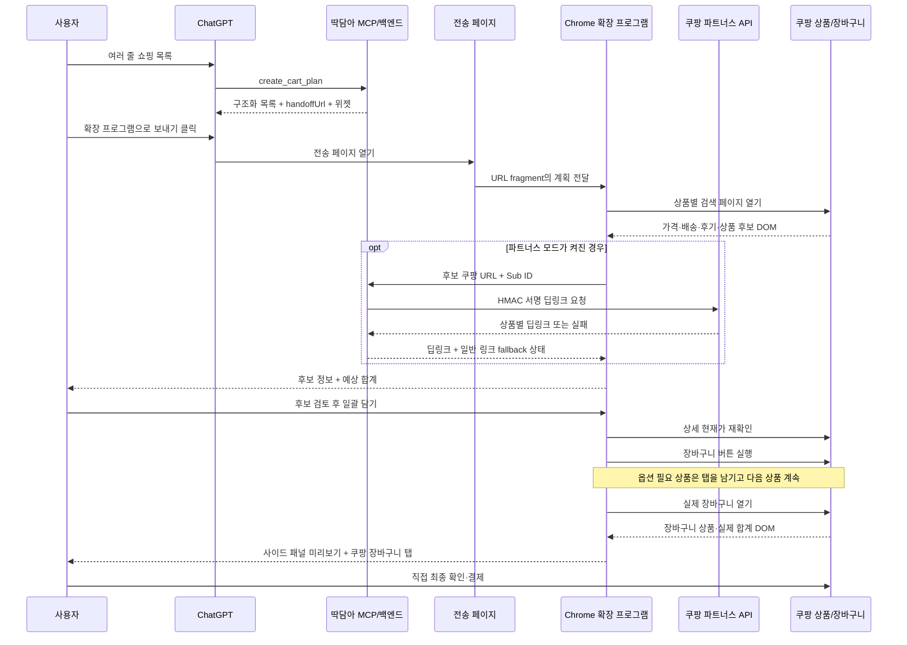

# 딱담아 v0.2 구조

## 전체 흐름



## 컴포넌트

### `shared/core.js`

- 자연어 목록 파싱
- 규격 추출
- 묶음 수량 추출
- 후보 점수화
- 장바구니 수량 계산
- 선택 상품 예상 합계 계산
- GPT ↔ 확장 프로그램 전송 계획 인코딩

동일 파일을 `scripts/sync-core.mjs`로 확장 프로그램과 서버에 복사합니다.

### Chrome 서비스 워커

- 백그라운드 검색 탭 관리
- 검색 결과·상품 상세·실제 장바구니 DOM 스크래핑
- 파트너스 서버 통신
- 순차 장바구니 담기
- 실제 장바구니 탭 재사용·활성화
- 로컬 상태·설정 관리

### Chrome 사이드 패널

- 목록 입력
- 후보 카드와 가격·배송·후기 표시
- 예상 합계
- 현재가 갱신
- 일괄 담기 진행 상태
- 실제 장바구니 미리보기와 바로가기
- 서버·GPT·파트너스 설정과 고지

### GPT 앱·백엔드

- `create_cart_plan` MCP 도구
- ChatGPT 위젯
- `/handoff` 전송 페이지
- `/api/partners/status`
- `/api/partners/deeplink`
- 쿠팡 파트너스 HMAC 서명

## 데이터 모델

### 장바구니 계획

```json
{
  "version": 1,
  "store": "coupang",
  "createdAt": "2026-07-12T00:00:00.000Z",
  "items": [
    {
      "id": "item-1",
      "raw": "스킨1004 히알루 시카 워터핏 선 세럼 50ml 2개",
      "name": "스킨1004 히알루 시카 워터핏 선 세럼 50ml",
      "quantity": 2,
      "specs": [
        { "value": 50, "unit": "ml", "normalized": "50ml" }
      ],
      "store": "coupang"
    }
  ]
}
```

### 후보

```json
{
  "id": "123456",
  "title": "상품명 50ml 2개",
  "url": "https://www.coupang.com/vp/products/123456",
  "affiliateUrl": "https://link.coupang.com/a/example",
  "affiliateStatus": "ready",
  "price": 18900,
  "originalPrice": 24000,
  "discountRate": 21,
  "unitPriceText": "10ml당 1,890원",
  "deliveryText": "로켓배송 · 내일 도착",
  "couponText": "와우회원 할인",
  "sellerText": "판매자명",
  "rating": 4.8,
  "reviewCount": 1523,
  "isRocket": true,
  "isOfficial": false,
  "soldOut": false,
  "packCount": 2,
  "score": 94,
  "confidence": "high"
}
```

### 실제 장바구니 스냅샷

```json
{
  "status": "ready",
  "items": [
    {
      "title": "상품명",
      "optionText": "50ml x 2",
      "quantity": 1,
      "price": 18900,
      "selected": true,
      "url": "https://www.coupang.com/vp/products/123456"
    }
  ],
  "summary": {
    "totalProductPrice": 24000,
    "discount": 5100,
    "deliveryFee": 0,
    "finalPrice": 18900,
    "selectedCount": 1,
    "itemCount": 1
  },
  "refreshedAt": "2026-07-12T00:01:00.000Z"
}
```

## 상품 매칭 점수

다음 신호를 조합합니다.

- 전체 이름 포함
- 첫 핵심어를 브랜드로 간주한 일치
- 핵심 토큰 교집합
- `ml`, `g`, `mg`, `정`, `매`, `병` 등의 규격 일치
- 요청 수량과 후보 묶음 수량 관계
- 로켓배송·공식 판매 표시
- 다른 브랜드·다른 용량·품절 감점

점수가 낮으면 자동 선택하지 않습니다.

## 예상 합계와 실제 합계

### 예상 합계

```text
선택 후보 가격 × 장바구니 수량
```

- 검색 결과 가격을 먼저 사용합니다.
- 일괄 담기 직전에 상세 페이지에서 갱신합니다.
- 정상가가 있으면 절약액을 참고용으로 계산합니다.
- 가격 미확인 상품은 합계에서 제외하고 개수를 별도 표시합니다.

### 실제 합계

쿠팡 장바구니 화면에서 가능한 경우 다음 레이블을 읽습니다.

- 총 상품가격
- 총 할인금액
- 배송비
- 결제예정금액 또는 총 주문금액

쿠폰·회원 할인·옵션 추가금은 실제 장바구니 값이 최종 기준입니다.

## GPT 앱 ↔ 확장 프로그램 전송

```text
https://server.example/handoff#ddakdama=<base64url-json>
```

URL fragment는 일반 HTTP 요청에 포함되지 않습니다. 등록된 서버 원본에서 온 전송만 확장 프로그램이 받습니다.

## 파트너스 설계

- Secret Key는 백엔드에만 존재
- 확장 프로그램은 공개 상품 URL과 Sub ID만 전송
- 서버가 HMAC 서명을 생성
- 반환 URL은 `https://link.coupang.com/`만 허용
- 상품별 딥링크가 없으면 원 URL 사용
- 사용자가 파트너스 모드를 켜고 관련 버튼을 누른 경우에만 경유
- 적용 상태를 후보 카드·합계·최종 확인창에 표시

## 실패 안전 설계

- 검색 결과가 없으면 해당 항목만 오류 표시
- 점수가 낮으면 자동 선택 안 함
- 현재가 갱신 실패 시 기존 가격 유지 및 경고
- 필수 옵션이 있으면 상품 탭을 활성화해 수동 확인
- 한 상품 실패가 나머지 담기를 중단하지 않음
- 장바구니 버튼 클릭 완료를 확인하지 못하면 성공 처리 안 함
- 마지막에는 성공 여부와 관계없이 실제 장바구니를 열 수 있음
- 결제·바로구매 버튼은 탐색 대상에서 제외
